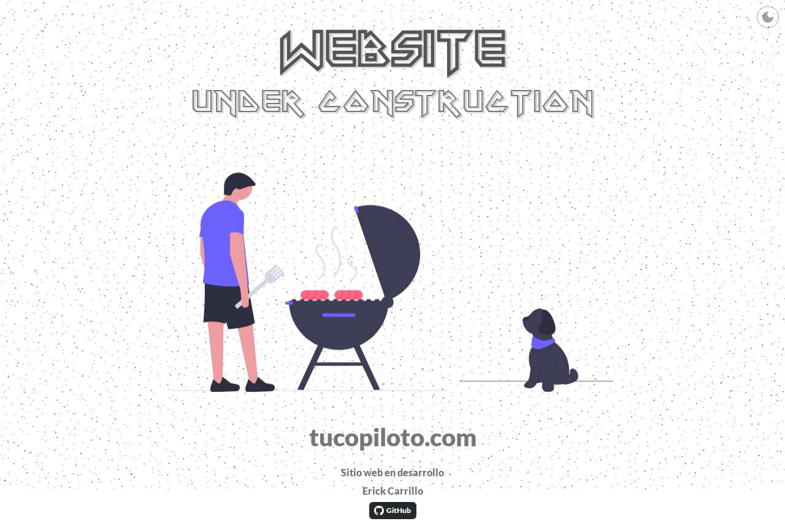
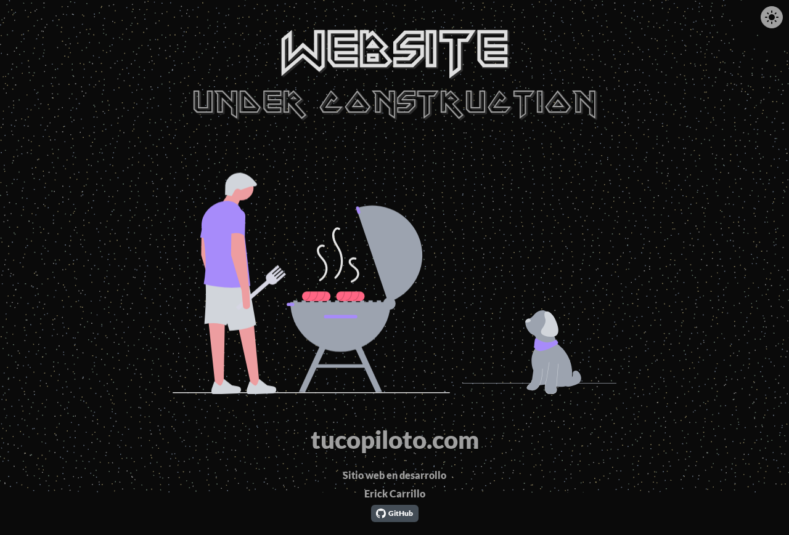

<div align="center">
  
  <h1>Web frontend template</h1>
  <p><strong>Plataforma web de última generación construida con Svelte 5 y Three.js</strong></p>

  [](https://svelte.dev)
  [](https://tailwindcss.com)
  [](https://threejs.org)
  [](https://opensource.org/licenses/MIT)
</div>

---

## 📸 Vista Previa

<div align="center">
  <table>
    <tr>
      <td align="center"><strong>Modo Claro</strong></td>
      <td align="center"><strong>Modo Oscuro</strong></td>
    </tr>
    <tr>
      <td></td>
      <td></td>
    </tr>
  </table>
</div>

---

## 🚀 Vision General

Esta es una demo que forma parte de una aplicación web moderna diseñada para la máxima eficiencia y una experiencia de usuario inmersiva. Este repositorio contiene el **frontend**, desarrollado con un stack liviano y moderno, enfocado en rendimiento, seguridad y una estética refinada aprovechando la nueva version de svelte 5 y su simplicidad.

tucopiloto.net nace como respuesta a un nicho en constante crecimiento, la necesidad de tener un asistente personal que nos ayude en nuestras tareas diarias, desde la gestión de tareas repetitivas, hasta la creacion de ordenes de compra, tucopilo responde a esas necesidades, enfocado en negocios emergentes, implementando tecnologias y los estandares mas modernos de la ingenieria de software como los RAG y el machine learning, ahorrando tiempo y recursos valiosos, y posicionando a nuestros usuarios a la vanguardia de la tecnologia convirtiendo tu proyecto en un negocio realmente competitivo en el mercado.

### ✨ Características Destacadas

- **⚛️ Svelte 5 Runes:** Gestión de estado reactiva de grano fino para un rendimiento superior.
- **🌌 Fondo de Partículas Interactivo:** Experiencia visual dinámica impulsada por **Three.js** con reactividad al tema (claro/oscuro).
- **🎨 Tailwind CSS v4:** Estilizado moderno utilizando la nueva arquitectura basada en CSS y directivas `@theme`.
- **🛡️ Autenticación Robusta:** Integración con **Better Auth** para flujos de inicio de sesión seguros (Email/Password & GitHub).
- **💾 Drizzle ORM:** Tipado seguro de extremo a extremo para la comunicación con la base de datos PostgreSQL.

---

## 🛠️ Stack Tecnológico

| Herramienta | Función |
| :--- | :--- |
| **SvelteKit** | Framework de Aplicación |
| **TypeScript** | Lenguaje de Programación |
| **Vite 7** | Herramienta de Construcción |
| **PostgreSQL** | Base de Datos Relacional (para futuras implementaciones) |
| **Playwright** | Testing de Extremo a Extremo |
| **Vitest** | Pruebas Unitarias y de Componentes |

---

## 🏃 Inicio Rápido

Sigue estos pasos para levantar el entorno de desarrollo localmente:

### 1. Clonar e instalar
```bash
git clone https://github.com/australisBite/tucopiloto-web.git
cd tucopiloto-web/micopiloto-web
pnpm install
```

### 2. Configuración de Variables de Entorno
Copia el archivo de ejemplo y rellena tus credenciales:
```bash
cp .env.example .env
```

### 3. Levantar Infraestructura (Docker)
```bash
pnpm db:start
```

### 4. Servidor de Desarrollo
```bash
pnpm dev
```

La aplicación estará disponible en `http://localhost:5173`.

---

## 🤝 Contribuir

¡Las contribuciones son bienvenidas! Por favor, revisa nuestras guías de estilo y abre un Issue antes de enviar un Pull Request.

---

<div align="center">
  Desarrollado por <strong>Erick Carrillo y Claude Code</strong><br/>
  <a href="https://github.com/australisBite">@australisBite</a>
</div>

